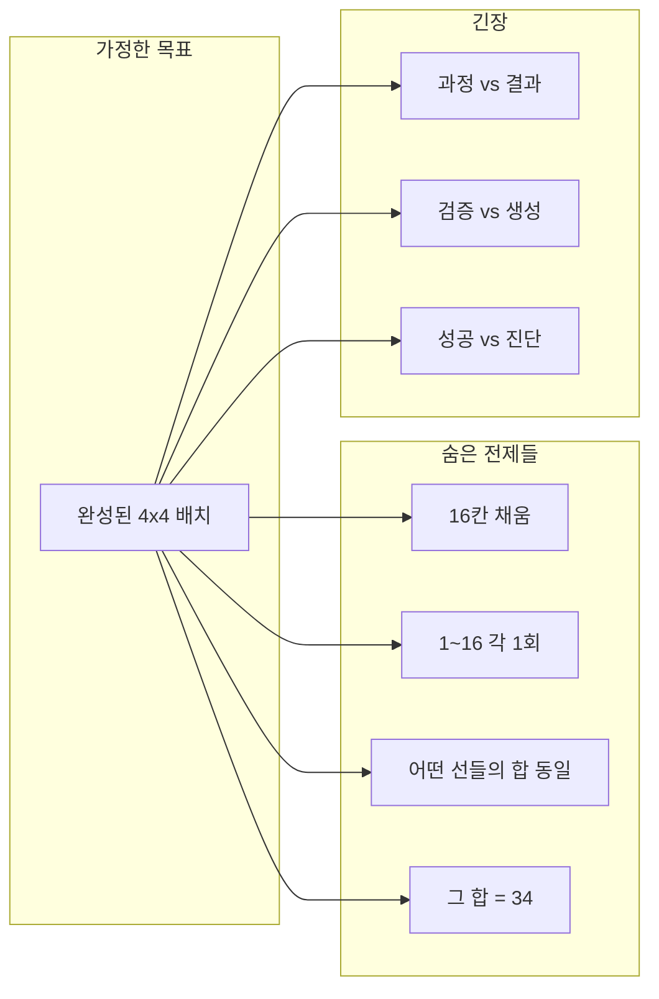
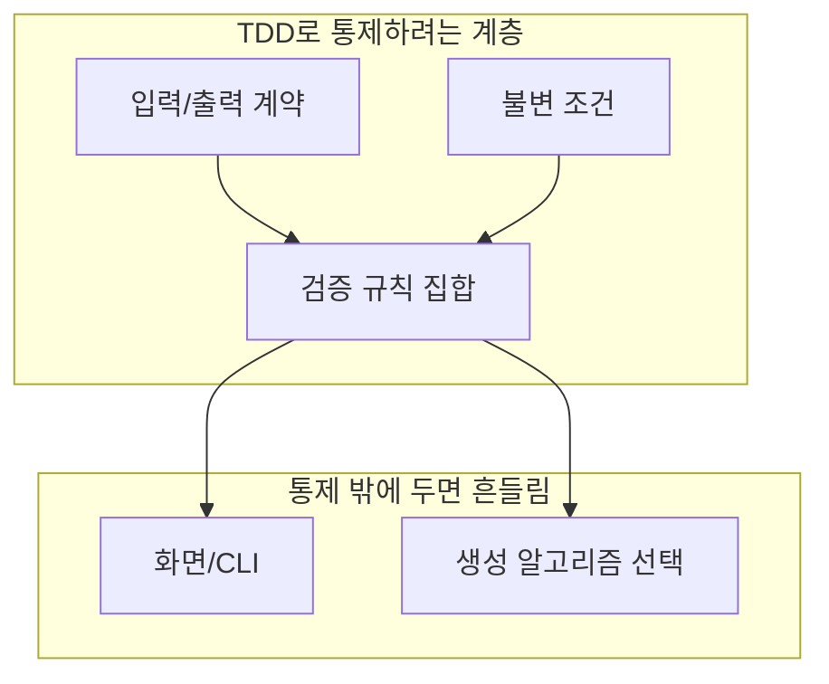
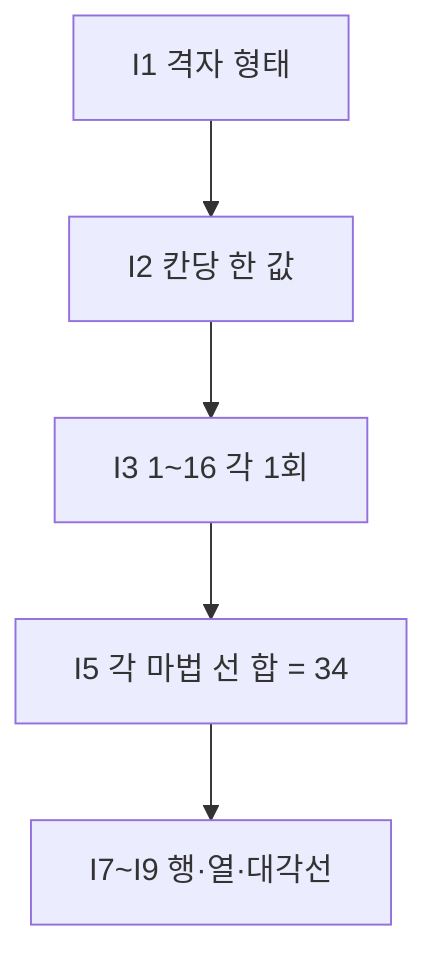

# 4x4 magic square problem definition
_Exported on 5/28/2026 at 14:03:24 GMT+9 from Cursor (3.5.17)_

---

**User**

당신은 문제 정의 전문가입니다.
나는 4x4 Magic Square 프로그램을 만들려고 합니다.
하지만 바로 설계하거나 구현하지 마십시오.
먼저 문제 인식 단계부터 진행하십시오.
--------------------------------------------
STEP 1 — Observation (관찰)
--------------------------------------------
다음 질문에 답하십시오:
1. 현재 우리가 해결하려는 상황은 무엇인가?
2. 왜 4x4 마방진 문제를 다루는가?
3. 이 문제는 어떤 학습 또는 시스템 설계 맥락에서 등장하는가?
“마방진을 만든다”는 표현 대신,상황을 관찰 관점으로 서술하십시오.

---

**Cursor**

프로젝트 맥락을 파악한 뒤 관찰 관점에서 답하겠습니다.

# STEP 1 — Observation (관찰)

워크스페이스(`MagicSquare_cyoon`)에는 아직 코드나 문서가 없습니다. 따라서 아래는 **지금 관찰 가능한 상황**과, 이 유형의 과제가 보통 놓이는 **일반적 맥락**을 함께 서술합니다.

---

## 1. 현재 우리가 해결하려는 상황은 무엇인가?

**관찰:** 한 사람(또는 한 팀)이 **4×4 격자** 위에 **1부터 16까지의 정수를 각 칸에 한 번씩** 배치하는 상황을 다루려 합니다. 배치가 끝났을 때, **여러 줄·열·대각선의 합이 모두 같은 값**이 되는지를 **판별하거나**, 그 조건을 만족하는 배치를 **찾거나**, 그런 배치를 **보여 주는** 흐름이 필요해 보입니다.

즉, 상황의 핵은 “숫자 퍼즐을 채운다”가 아니라 다음과 같이 볼 수 있습니다.

- **입력/출력:** 4×4 격자와 16개의 서로 다른 정수
- **제약:** 행 4개, 열 4개, (문제 정의에 따라) 대각선 등의 **선형 합(합계)이 동일**해야 함
- **행위:** 조건 충족 여부 확인, 충족 배치 탐색, 결과 표시·설명
- **맥락:** 아직 구현물은 없고, **요구를 말로 정리하는 단계**에 있음

“무엇을 만든다”보다 **“16개 숫자를 격자에 놓았을 때, 정해진 여러 합이 일치하는지를 다루는 상황”**으로 보는 것이 관찰에 가깝습니다.

---

## 2. 왜 4×4 마방진 문제를 다루는가?

**관찰:** 이 주제가 선택된 이유는 보통 다음 중 하나 이상과 겹칩니다(아직 사용자가 명시한 이유는 없음).

| 관찰 가능한 동기 | 설명 |
|------------------|------|
| **규모가 적당함** | 3×3보다 제약이 많고, 5×5 이상보다 탐색·표현이 단순해 **첫 구현·학습용**으로 자주 쓰임 |
| **수학·퍼즐 맥락** | 고전 퍼즐·조합·대칭 등 **명확한 규칙**이 있어 “맞다/틀리다”가 검증하기 쉬움 |
| **프로그래밍 연습** | 2차원 배열, 반복, 합 검증, (필요 시) 백트래킹·휴리스틱 등 **알고리즘·구조**를 한 문제에 모으기 좋음 |
| **프로젝트 이름** | 폴더명 `MagicSquare_cyoon`은 **개인 학습·과제·포트폴리오** 성격을 시사함 |

**아직 확인되지 않은 것:** “모든 4×4 마방진 생성”인지, “주어진 합을 만족하는 하나만”인지, “사용자가 칸을 채우고 검증”인지, “짝수 차수(4) 특유 알고리즘 학습”인지 — **목적 문장이 없으므로 ‘왜’의 구체적 이유는 관찰 단계에서 가설**로만 둡니다.

---

## 3. 이 문제는 어떤 학습 또는 시스템 설계 맥락에서 등장하는가?

**관찰:** 이런 문제는 보통 아래 맥락에 **끼워 넣는 연습 대상**으로 등장합니다.

### 학습 맥락
- **입문 알고리즘·자료구조:** 2D 배열, 중첩 루프, 불변 조건 검사
- **조합·탐색:** 완전 탐색, 가지치기, 백트래킹의 **작은 인스턴스**
- **수학·이산:** 홀수/짝수 차수 마방진 구성법, 합 = \(n(n^2+1)/2\) 등 **불변량** 이해
- **소프트웨어 공학 입문:** 요구 정의 → 검증 규칙 명세 → UI/CLI 분리

### 시스템 설계 맥락(작은 시스템이라도)
- **도메인:** “격자 + 16 정수 + 합 제약”
- **핵심 서비스:** 배치 검증기, (선택) 생성기/솔버, (선택) 프레젠테이션
- **품질 이슈:** 잘못된 입력, 중복 숫자, 부분만 채운 격자, “대각선까지 포함할지” 같은 **규칙 경계**
- **확장 압력:** 3×3/5×5로 일반화, 파일 입출력, 시각화 — 관찰상 **아직 범위 미정**

**지금 단계에서의 위치:** 구현·설계 이전의 **문제 인식** — “무엇이 같은 합인지”, “누가 무엇을 입력하는지”, “성공이 무엇인지”를 관찰·질문으로 고정하는 단계입니다.

---

## 관찰 요약 (한 문장)

**누군가가 4×4 격자에 1~16을 한 번씩 놓았을 때, 여러 방향의 합이 하나의 값으로 맞는지를 다루는 상황**을 정리하려 하며, 그 이유와 범위(검증만 / 생성 / UI / 학습 목표)는 아직 말로 고정되지 않았고, 저장소도 비어 있어 **요구를 관찰 언어로 먼저 쓰는 단계**에 있습니다.

---

다음 단계(STEP 2 등)로 가려면, 위 가설 중 **본인의 “왜”**(예: 수업 과제, 알고리즘 연습, 웹 데모)를 한 줄만 알려 주시면 관찰을 그에 맞게 좁힐 수 있습니다. 설계·구현은 요청하실 때까지 하지 않겠습니다.

---

**User**

--------------------------------------------
STEP 2 — Why #1
--------------------------------------------
Q: 왜 마방진을 완성해야 하는가?
A를 가정하여 답하고, 그 답에서 드러나는 불편함 또는 구조적 문제를 분석하십시오.

---

**Cursor**

# STEP 2 — Why #1

## 가정한 답 (A)

**「4×4 격자에 1~16을 한 번씩 배치했을 때, 모든 행·열·(문제에서 요구하는) 대각선의 합이 같음을 확인할 수 있는 상태로 두어야, ‘이 배치가 규칙을 만족하는지’를 사람이 즉시 판단할 수 있기 때문이다.」**

즉, “완성”의 동기는 **미술·장식**이 아니라 **검증 가능한 정답 상태**—규칙 충족 여부를 **한눈에·기계적으로** 확인할 수 있게 두는 것—으로 가정합니다. (학습 과제, CLI/콘솔 퍼즐, 자기 검증용 도구 등에서 흔한 동기입니다.)

---

## 이 답에서 드러나는 불편함

### 1. “완성”의 기준이 아직 관찰되지 않음

“완성해야 한다”는 말은 보통 다음 중 **하나**를 전제합니다.

| 완성의 의미 | 불편함 |
|------------|--------|
| **16칸이 모두 채워짐** | 빈 칸이 있어도 “거의 맞음”을 보고 싶을 수 있음 → 진행 중 상태와 최종 상태가 섞임 |
| **합이 모두 같음** | 어떤 선(행·열·대각선)까지 같은 합인지 정의가 없으면 “완성” 판정이 사람마다 다름 |
| **1~16이 각각 한 번** | 숫자 중복·누락·범위 밖 값은 “합은 맞지만 완성 아님” → 검증 규칙이 둘 이상 필요 |

**구조적 문제:** “완성”이 **단일 불리언**이 아니라 **여러 조건의 교집합**인데, Why #1은 그중 **합 일치**만 강조하면 나머지 조건이 뒤로 밀립니다.

---

### 2. “완성”을 목표로 두면 탐색 부담이 숨겨짐

4×4에서 1~16을 무작위로 놓는 경우, 조건을 만족하는 배치는 전체 배열의 극히 일부입니다.

- **불편함:** “완성해야 한다”는 목표만 있으면, 사용자·시스템은 **얼마나 시도해야 하는지**, **막히면 어떻게 하는지**가 비어 있습니다.
- **구조적 문제:** 목적(완성된 격자)과 수단(손으로 채우기 / 자동 생성 / 힌트)이 분리되지 않아, 나중에 **생성기·솔버·힌트** 중 무엇이 필수인지 요구가 흔들립니다.

---

### 3. 검증 목적과 “만들기” 목적의 충돌

가정한 A는 **“판단할 수 있게”**가 핵심입니다.

- **불편함:** 완성된 격자 하나만 있으면 검증은 한 번이면 끝나지만, **학습·연습**에서는 오히려 **틀린 배치·부분 배치**를 자주 다뤄야 합니다.
- **구조적 문제:** 시스템이 “완성품만 다루는가” vs “과정 중 배치도 다루는가”에 따라 API·상태 모델이 갈립니다. Why가 “완성”에 고정되면 **중간 상태**가 1급 시민이 되기 어렵습니다.

---

### 4. 4×4만 고정할 때의 일반화 압력

“4×4 마방진을 완성”은 범위가 좁아 **의도적으로 좋은 학습 크기**이지만,

- **불편함:** 짝수 차(4)는 홀수 차와 **구성 방법·대칭**이 다름 → “완성” 알고리즘을 3×3에서 가져오면 실패하거나 다른 규칙이 필요함.
- **구조적 문제:** 도메인 지식(짝수 마방진, 패닝 등)이 **코드 한곳**에 박히면, 나중에 n×n으로 옮길 때 **검증 로직**과 **생성 로직**이 한 덩어리로 붙어 있을 위험이 큽니다.

---

### 5. 사용자 관점의 “왜 완성?”이 시스템에 전달되지 않음

A가 맞다면 사용자는 사실 **“완성된 격자”**보다 **“내가 놓은 게 맞는지 확인”**을 원할 수 있습니다.

- **불편함:** 완성만 강조하면 UI/흐름이 **결과 출력** 중심이 되고, **어느 행·열이 틀렸는지**는 후순위가 됩니다.
- **구조적 문제:** 성공 정의가 `all_sums_equal` 하나면, **진단 정보**(어떤 선이 몇 차이 나는지)가 요구에 없어서 나중에 **기능 추가 = 요구 변경**으로 보입니다.

---

## 구조적 문제 요약 (설계 전에 보이는 긴장)

| 긴장 | 한 줄 |
|------|--------|
| **완성 vs 검증** | 목표는 “맞는 격자”인데, 실제 가치는 “맞는지 아는 것”일 수 있음 |
| **결과 vs 과정** | 완성만 저장하면 연습·힌트·되돌리기 요구와 맞지 않음 |
| **단일 성공 vs 다중 규칙** | “합 같음”만으로는 마방진 정의가 불완전할 수 있음 |
| **4 고정 vs 일반화** | 학습에는 좋지만, 모듈 경계를 나중에 나누기 어렵게 만듦 |

---

## STEP 2에서 남는 관찰 질문 (구현 아님)

가정 A를 유지할지, 수정할지 판단하려면 다음이 **Why #1을 구체화**합니다.

1. “완성”은 **사람이 손으로 끝까지 채우는 것**인가, **프로그램이 조건 만족 배치를 내는 것**인가?
2. 대각선까지 **반드시** 같은 합이어야 “완성”인가? (4×4 마방진 정의에 따라 달라짐)
3. 완성이 안 되었을 때도 **가치가 있는가**(예: 부분 검증, 힌트)?

원하시면 **STEP 3**에서 같은 방식으로 **Why #2**(예: “왜 4×4인가”, “왜 프로그램으로 하는가”)를 가정·분석하겠습니다. 설계·구현은 하지 않습니다.

---

**User**

--------------------------------------------
STEP 3 — Why #2
--------------------------------------------
Q: 왜 단순 계산이 아니라 프로그램으로 구현하는가?
다음 관점에서 답하십시오:
- 반복 가능성
- 검증 자동화
- 오류 방지
- 규칙 기반 사고 훈련

---

**Cursor**

# STEP 3 — Why #2

**질문:** 왜 단순 계산이 아니라 프로그램으로 구현하는가?

STEP 2에서 쓴 가정을 이어갑니다. **「규칙을 만족하는 4×4 배치인지, 사람이 매번 손으로 확인하기엔 부담이 크다」**는 상황에서, **계산기·종이·머리** 대신 **프로그램**을 두는 이유를 네 관점으로 정리합니다. (아직 설계·구현은 하지 않습니다.)

---

## 가정한 답 (A)

**「같은 규칙(16칸, 1~16 각 1회, 정해진 선들의 합 동일)을 여러 번·여러 입력에 적용하고, 결과를 일관되게 판정·기록하려면, 규칙을 코드로 고정한 실행 환경이 손계산보다 적합하기 때문이다.」**

---

## 1. 반복 가능성

### 프로그램이 주는 것
- **동일 규칙, 동일 절차:** 실행할 때마다 같은 순서로 “채움 여부 → 중복 → 각 선의 합 → 기대 합(34)과 비교”를 적용할 수 있음.
- **많은 시도:** 연습·탐색·테스트에서 격자를 수십·수백 번 바꿔도, 사람이 매번 처음부터 다시 더하지 않아도 됨.
- **재현:** “이 입력이었을 때 왜 틀렸는지”를 **같은 입력 + 같은 버전**으로 다시 돌려 확인 가능.

### 단순 계산만으로 할 때의 불편함
- 손계산은 **피로·시간**에 따라 절차가 느슨해짐(대각선 빼먹기, 한 행만 다시 검사 등).
- **반복**이 늘수록 “대충 맞는 것 같다”로 끝나기 쉬움.

### 구조적 문제
- 반복 가능성은 **“규칙이 코드/스크립트에 명시되어 있을 때”** 성립함. 규칙이 README나 머릿속에만 있으면, 반복은 **같은 실수의 반복**이 될 수 있음.
- “여러 번 돌린다”는 요구가 생기면 곧 **입력 형식·실행 방식(CLI, 파일, 테스트)** 이슈가 따라옴 → Why #2가 곧 **인터페이스·상태 저장** 질문으로 이어짐.

---

## 2. 검증 자동화

### 프로그램이 주는 것
- **판정의 기계화:** “모든 대상 선의 합 == M”을 조건으로 **true/false**(또는 위반 목록)로 내림.
- **부분 검증:** 16칸이 다 안 채워졌어도, “지금까지 채운 선만” 검사하는 정책을 **명시적으로** 둘 수 있음(STEP 2의 과정 vs 결과 긴장과 연결).
- **

---

**User**

--------------------------------------------
STEP 4 — Why #3 (핵심 발견)
--------------------------------------------
Q: 왜 이 문제를 TDD 방식으로 설계하려 하는가?
- 무엇이 통제되어야 하는가?
- 어떤 불변 조건이 존재하는가?
- 왜 입력/출력이 명확해야 하는가?

---

**Cursor**

# STEP 3 — Why #2  
**Q: 왜 단순 계산이 아니라 프로그램으로 구현하는가?**

STEP 1·2에서 본 상황(4×4 격자, 1~16, 여러 선의 합 일치)을 전제로, **손계산·종이·계산기**와 **프로그램**을 대비해 답합니다. 설계·구현은 하지 않습니다.

---

## 가정한 답 (A)

**「같은 규칙을 여러 배치에 반복 적용하고, 합·중복·범위를 사람이 매번 다시 세지 않게 하며, ‘맞다/틀리다’를 일관된 기준으로 자동 판정하기 위해 프로그램이 필요하다.」**

4×4 마방진은 한 번의 덧셈으로 끝나지 않습니다. **행 4 + 열 4 + (정의에 따른) 대각선**과 **16칸 채움·1~16 각 1회**가 동시에 걸립니다. 규모는 작지만 **검사 횟수와 규칙 개수**는 “단순 계산”보다 **절차·규칙의 반복**에 가깝습니다.

---

## 네 가지 관점

### 1. 반복 가능성 (Repeatability)

| 손으로 하기 | 프로그램으로 하기 |
|------------|------------------|
| 배치를 바꿀 때마다 합을 다시 계산 | **동일한 절차**로 임의의 4×4 배치를 검사 |
| “지난번이랑 같은 방법으로 검사했는지” 기억에 의존 | **같은 입력 → 같은 판정** (결정적 검증) |
| 여러 예시·테스트 케이스를 비교하기 번거로움 | 수십·수백 배치를 **동일 기준**으로 일괄 처리 가능 |

**불편함:** 반복 가능성을 원하면 **“무엇을 입력으로 주는가”**(16개 숫자의 순서, 2D 배열, 파일 등)가 먼저 고정되어야 합니다. 입력 형식이 흔들리면 “반복”이 아니라 **매번 다른 문제**를 푸는 것과 같습니다.

**구조적 함의:** 프로그램의 가치는 **연산 속도**보다 **절차의 복제**에 있습니다.

---

### 2. 검증 자동화 (Automated verification)

STEP 2에서 가정한 동기(“규칙을 만족하는지 즉시 판단”)와 직결됩니다.

- **자동화 대상:** 각 행/열/대각선의 합, 목표 합(4×4이면 34), 1~16 사용 여부, 빈 칸 여부 등  
- **자동화의 이점:** 피로·주의력 저하로 **한 줄만 놓치는 실수** 제거  
- **한계:** “자동 검증”은 **명세된 규칙**만 검사합니다. 대각선을 포함할지, “반마방진”인지 등 **규칙이 코드/테스트에 없으면** 자동화는 잘못된 확신을 줍니다.

**불편함:** 검증 로직과 **생성/힌트**를 한 덩어리로 만들면, “검증만 필요한데도 전체를 돌려야” 하는 구조가 됩니다. STEP 2의 **검증 vs 생성** 긴장이 여기서도 나타납니다.

---

### 3. 오류 방지 (Error prevention)

손계산·수기 검증에서 흔한 오류:

- 한 행은 맞는데 **다른 열**을 안 셈  
- **중복 숫자**(합은 우연히 맞을 수 있음) 미확인  
- **대각선** 포함 여부 혼동  
- 4×4에서 **목표 합 34**를 잘못 기억  

프로그램은 **규칙을 한곳에 모아** 이런 누락을 “실수”가 아니라 **실행 경로 밖**으로 만듭니다.

**구조적 문제:** 오류 방지는 **요구가 코드에 정확히 반영됐을 때만** 성립합니다. 요구가 “합만 같으면 됨”으로 느슨하면, 프로그램도 **느슨한 안전**만 제공합니다. STEP 2의 **다중 조건(합 + 순열 + 채움)** 이 프로그램화의 전제입니다.

---

### 4. 규칙 기반 사고 훈련 (Rule-based thinking)

종이에 답을 쓰는 것과, 프로그램을 만드는 것은 인지 부담이 다릅니다.

| 종이/계산 | 프로그램 |
|----------|----------|
| 직관·패턴 (“이렇게 하면 될 것 같다”) | **규칙을 문장·함수·테스트로 분해**해야 함 |
| “대충 맞는 것 같다” | **예/아니오**와 **경계 케이스**를 명시해야 함 |
| 규칙 예외를 말로 넘김 | 예외가 **버그 또는 실패한 테스트**로 드러남 |

**훈련 목표:** “마방진이란 무엇인가”를 **검증 가능한 조건의 집합**으로 다루는 연습. 4×4는 규모가 작아 **규칙 ↔ 테스트 ↔ 구현** 대응을 보기 좋습니다.

**불편함:** 규칙을 너무 일찍 코드에 박으면, 수학적 통찰(예: 짝수 차 구성법) 없이 **테스트 통과용 최소 규칙**만 남을 수 있습니다. “훈련”과 “최소 구현” 사이의 균형이 STEP 4(TDD)와 맞닿습니다.

---

## STEP 3 요약

프로그램을 쓰는 이유는 **16칸 덧셈이 어려워서**가 아니라,

1. **같은 검증 절차를 무한히 복제**하고  
2. **판정 기준을 사람마다 다르지 않게** 하며  
3. **누락·중복·정의 혼동**을 줄이고  
4. **규칙을 명시적·기계적으로** 다루는 연습을 하기 위함  

입니다. 이 네 가지는 STEP 4의 TDD와 **같은 방향**(명세·불변·입출력 고정)을 가리킵니다.

---

# STEP 4 — Why #3 (핵심 발견)  
**Q: 왜 이 문제를 TDD 방식으로 설계하려 하는가?**

TDD를 “테스트를 먼저 쓰는 습관”이 아니라, **이 도메인에서 무엇이 먼저 고정되어야 하는지**를 드러내는 설계 방식으로 답합니다.

---

## 가정한 답 (A)

**「마방진은 짧은 정의처럼 보이지만 실제로는 여러 독립 조건의 교집합이고, 4×4는 경계 예시가 많아서, 테스트로 조건·입출력·불변을 먼저 고정하지 않으면 ‘완성’과 ‘검증’이 구현 과정에서 계속 바뀌기 때문이다.」**

STEP 2의 **완성 vs 검증**, STEP 3의 **규칙 명시**가 TDD 없이는 **리팩터링 불가능한 if문 덩어리**로 가기 쉽습니다.

---

## 1. 무엇이 통제되어야 하는가?

TDD로 **통제(명세화)** 하려는 것은 대략 다음과 같습니다.

| 통제 대상 | 통제하지 않으면 생기는 일 |
|----------|---------------------------|
| **어떤 선을 검사하는가** | 행만 맞고 대각선은 빼는 등 정의 표류 |
| **“성공”의 정의** | 합만 맞거나, 1~16 없이도 “통과” |
| **입력 형태** | 1차원 16개 vs 4×4, 빈 칸 표현 등 매 테스트마다 상이 |
| **출력 형태** | `true/false`만 vs 어떤 선이 틀렸는지 vs 마법 상수 34 |
| **생성 vs 검증 경계** | 솔버 테스트가 검증 테스트를 오염 |
| **4×4 고정 vs 일반화** | n=4 하드코딩이 전역으로 퍼짐 |

**핵심 발견:** 통제의 중심은 **UI가 아니라 “판정 함수(또는 도메인 코어)”**입니다. TDD는 그 코어에 **계약(contract)** 을 걸기 위한 수단입니다.

---

## 2. 어떤 불변 조건이 존재하는가?

4×4, 1~16을 쓰는 **표준 마방진**을 전제할 때, 테스트로 고정하기 좋은 불변(invariants) 예시입니다. (정의를 바꾸면 목록도 바뀝니다—그래서 TDD가 필요합니다.)

### 구조·숫자 불변

| 불변 | 내용 |
|------|------|
| **크기** | 격자는 4×4, 총 16칸 |
| **숫자 집합** | 사용된 값은 정확히 {1,…,16}, 중복·누락 없음 |
| **마법 상수** | (정의된) 각 “마법 선”의 합 = **34** (= 4×(4²+1)/2) |

### 합 불변 (검사 대상 선)

| 불변 | 내용 |
|------|------|
| **행** | 4개 행 각각의 합 = 34 |
| **열** | 4개 열 각각의 합 = 34 |
| **대각선** | (문제에서 요구 시) 주대각선·부대각선 합 = 34 |

### 메타 불변 (테스트 설계용)

| 불변 | 내용 |
|------|------|
| **결정성** | 같은 격자 입력 → 같은 검증 결과 |
| **대칭 예시** | 알려진 정답 격자(고전 4×4 예)는 항상 통과 |
| **반례** | 한 칸만 바꾼 배치, 한 행만 맞춘 배치 등은 실패(또는 명시된 실패 유형) |

**핵심 발견:** 불변은 **한 번에 하나씩** 테스트로 끌어내기 좋습니다.  
예: 먼저 “1~16 각 1회”, 다음 “행 합”, 다음 “열 합”, 다음 “대각선”—이 순서가 곧 **요구 분해**이고, STEP 2에서 말한 **“완성 = 여러 조건의 교집합”**을 코드 구조와 맞춥니다.

**주의:** “합이 모두 같다”만으로는 **1~16**이 보장되지 않습니다. 불변을 나누지 않으면 TDD가 **잘못된 초록 테스트**를 고정할 수 있습니다.

---

## 3. 왜 입력/출력이 명확해야 하는가?

TDD에서 테스트는 **작은 시스템의 사양서**입니다. 입출력이 흐리면 테스트가 사양이 아니라 **메모**가 됩니다.

### 입력이 명확해야 하는 이유

- **반복 가능성(STEP 3):** `[[8,1,6,7], ...]` vs `1..16` 나열 vs 빈 칸 `null` — 형식마다 **다른 프로그램**이 됨  
- **경계 케이스:** 빈 격자, 일부만 채움, 범위 밖 숫자, 중복 — “입력이 아니다” vs “실패 판정”을 구분해야 함  
- **테스트 가독성:** 알려진 정답 격자 하나를 **리터럴로** 넣을 수 있어야 회귀 테스트가 의미 있음  

### 출력이 명확해야 하는 이유

- **최소:** `isValid(grid) -> bool` — STEP 2의 “맞다/틀리다”만 통제  
- **확장:** `magicConstant` → 34, `failedLines` → 진단 — STEP 2의 **성공 vs 진단** 긴장을 나중에 키울지 여부를 초기에 결정  
- **생성기 추가 시:** 검증 출력과 생성 출력을 **다른 계약**으로 두지 않으면 테스트가 깨짐  

**핵심 발견:** 입출력을 명확히 한다는 것은 **사용자 화면**이 아니라 **도메인 API 계약**을 먼저 고정한다는 뜻입니다. TDD는 그 계약을 **실행 가능한 문서**로 만듭니다.

---

## STEP 4 — 세 질문을 한 줄로 묶으면

| 질문 | TDD가 드러내는 것 |
|------|------------------|
| 무엇을 통제? | 검증 규칙·성공 정의·검증/생성 경계 |
| 불변 조건? | 16개 숫자, 합 34, 행/열/(대각선), 결정성·정답/반례 예시 |
| 입출력 명확? | 테스트가 곧 계약; 흔들리면 반복·자동화·오류 방지가 무너짐 |

**Why #3 한 문장:**  
4×4 마방진은 **작지만 정의가 여러 겹**이므로, TDD로 **불변과 입출력을 먼저 고정**해야 STEP 2의 “완성”과 STEP 3의 “자동 검증·규칙 명시”가 구현 중에 바뀌지 않습니다.

---

## STEP 3 ↔ STEP 4 연결

| STEP 3 동기 | STEP 4(TDD)에서의 대응 |
|------------|-------------------------|
| 반복 가능성 | 동일 입력에 대한 테스트 스위트·회귀 |
| 검증 자동화 | 검증 코어에 대한 단위 테스트 |
| 오류 방지 | 반례·경계 케이스를 테스트로 고정 |
| 규칙 기반 사고 | Red → Green → Refactor로 규칙을 조각내며 명시 |

---

다음 단계(예: **STEP 5 — 문제 진술**, 또는 **성공 기준·비목표** 정리)로 가려면 알려 주세요. 설계·코드·테스트 작성은 요청하실 때까지 하지 않겠습니다.

---

**User**

--------------------------------------------
STEP 5 — 진짜 문제 정의
--------------------------------------------
다음을 작성하십시오:
1. 표면 문제 정의 (잘못된 정의)
2. 개선된 문제 정의 (정확한 정의)
3. 이 문제의 핵심 Invariant
4. 우리가 실제로 훈련하려는 사고 능력
−	구현 설계는 하지 마십시오.
−	코드 언급 금지.
−	알고리즘 설명 금지.
−	구조화된 Markdown으로 작성하십시오.

---

**Cursor**

# STEP 5 — 진짜 문제 정의

STEP 1~4에서 드러난 관찰·동기·긴장을 바탕으로, **구현·알고리즘·코드 없이** 문제만 고정합니다.

---

## 1. 표면 문제 정의 (잘못된 정의)

> **「4×4 격자에 1부터 16까지 숫자를 넣어, 모든 줄의 합이 같은 마방진을 완성하는 프로그램을 만든다.」**

### 왜 잘못된 정의인가

| 함정 | 결과 |
|------|------|
| **「완성」**만 강조 | 목표가 “맞는 배치를 **만드는 것**”으로 고정되고, “주어진 배치가 **맞는지 판단하는 것**”이 사라짐 |
| **「모든 줄」**이 모호 | 행·열만인지, 대각선까지인지 불명확 → 완성·검증 기준이 사람마다 달라짐 |
| **「합이 같다」**만 명시 | 1~16을 각각 한 번 쓰는지, 빈 칸·중복·범위 밖 값은 다루지 않음 → 합만 맞는 **가짜 성공** 가능 |
| **「프로그램」**이 곧 솔버 | 검증·진단·연습·규칙 명시보다 **정답 생성**이 전부인 것처럼 범위가 과대 |
| **훈련 목표 부재** | 무엇을 배우는지(규칙 분해, 계약, 불변)가 정의에 없어 요구가 구현 중에 표류함 |

**한 줄:** 퍼즐 **결과물**만 말하고, **판정 규칙·입력 상태·성공 조건·학습 의도**가 빠져 있다.

---

## 2. 개선된 문제 정의 (정확한 정의)

> **「4×4 격자에 놓인 16개의 값(각 칸 하나, 값은 1~16이며 서로 중복 없음)에 대해, 사전에 고정한 ‘마법 선’(행 4, 열 4, 문제 범위에서 합의한 대각선)마다 합이 동일한지—그 공통 합이 4×4 마방진의 마법 상수와 일치하는지—를 일관된 기준으로 판정할 수 있게 한다.  
> 동일한 판정 절차를 임의의 배치에 반복 적용할 수 있으며, 판정에 쓰는 조건·입력·출력(맞음/틀림, 필요 시 어느 조건이 깨졌는지)를 명시해 두어, 이후 생성·힌트·화면 등은 이 판정 계약을 바꾸지 않고 붙일 수 있게 한다.  
> 이 과정에서 ‘마방진이란 무엇인가’를 검증 가능한 조건의 집합으로 다루고, 조건·반례·경계를 먼저 고정한 뒤 구현하는 연습(규칙 기반·테스트 주도 설계)을 한다.」**

### 정의에 포함된 것

| 요소 | 내용 |
|------|------|
| **대상** | 4×4 격자, 16칸, 값 집합 {1,…,16} 각 1회 |
| **핵심 행위** | 조건 충족 **판정** (완성·생성은 범위 밖이거나 후순위) |
| **규칙 경계** | 어떤 선을 검사할지 **사전 고정** (대각선 포함 여부는 정의의 일부) |
| **일관성** | 같은 배치 → 같은 판정; 절차 반복 가능 |
| **계약** | 입력(배치 표현), 출력(성공/실패, 선택적 진단) 명시 |
| **학습** | 조건 분해·불변·반례를 먼저 고정하는 사고 방식 |

### 의도적으로 비우는 것 (이 단계)

- 정답 격자를 **누가** 채우는지(사람 / 자동)
- 화면·파일·명령 형태
- 조건을 만족하는 배치를 **찾는** 방법

---

## 3. 이 문제의 핵심 Invariant

아래는 **표준 4×4, 1~16, 행·열·두 대각선을 마법 선으로 둔 경우**의 핵심 불변입니다. 대각선을 빼기로 하면 목록에서 대각선 관련 항만 정의에서 제외하면 됩니다.

### A. 격자·값 불변

| ID | 불변 | 위반 시 |
|----|------|---------|
| I1 | 격자는 정확히 4×4, 16칸 | 칸 수·차원 불일치 |
| I2 | 각 칸에 정확히 하나의 값 | 빈 칸, 다중 값 |
| I3 | 사용된 값의 집합은 {1,…,16}과 동일 (중복·누락 없음) | 같은 숫자 두 번, 1~16 밖, 미사용 숫자 |
| I4 | (I3가 성립할 때) 모든 값의 총합은 136 | I3와 모순되는 배치 |

### B. 마법 상수 불변

| ID | 불변 | 위반 시 |
|----|------|---------|
| I5 | 정의된 각 마법 선의 합은 **34**와 같음 | 어느 한 선이라도 34가 아님 |
| I6 | (I3·I5가 모두 성립할 때) “모든 마법 선의 합이 서로 같다”는 I5와 동치 | I3 없이 합만 맞춘 배치는 I5만으로는 불충분할 수 있음 |

### C. 마법 선 불변 (검사 범위)

| ID | 불변 | 위반 시 |
|----|------|---------|
| I7 | 4개 행 각각이 마법 선 | 특정 행 합 ≠ 34 |
| I8 | 4개 열 각각이 마법 선 | 특정 열 합 ≠ 34 |
| I9 | 주대각선·부대각선이 마법 선 (범위에 포함한 경우) | 대각선 합 ≠ 34 |

### D. 판정·절차 불변 (문제 자체의 메타 불변)

| ID | 불변 | 위반 시 |
|----|------|---------|
| I10 | 동일 배치에 대해 판정 결과는 항상 동일 | 같은 입력에 다른 결론 |
| I11 | 판정은 고정된 조건 집합(I1~I9 중 채택분)만 사용 | 검사 항목이 실행마다 달라짐 |
| I12 | 알려진 정답 배치(합의된 예시)는 판정에서 성공 | 규칙·예시 불일치 |
| I13 | 조건을 일부러 깬 반례 배치는 해당 조건에서 실패 | 규칙이 너무 느슨하거나 느슨한 테스트 고정 |

### 불변 간 우선 관계 (개념만)

**핵심:** “합이 모두 같다”(I6)만으로는 I3를 대체할 수 없음. **숫자 집합 불변(I3)** 과 **선별 합 불변(I5·I7~I9)** 은 별도로 통제해야 한다.

---

## 4. 우리가 실제로 훈련하려는 사고 능력

구현 기술이 아니라, **문제를 다루는 방식**입니다.

| # | 사고 능력 | 훈련 내용 | 이 문제에서의 드러남 |
|---|----------|----------|---------------------|
| 1 | **규칙 분해** | 하나의 말(“마방진”)을 검증 가능한 조건 여러 개로 나눔 | 채움·순열·행·열·대각선·마법 상수를 각각 독립 조건으로 다룸 |
| 2 | **계약 사고** | 입력이 무엇인지, 성공/실패가 무엇인지, 진단을 줄지 말지를 먼저 합의 | “완성” 대신 “판정 결과”를 시스템의 1차 출력으로 둠 |
| 3 | **불변 인식** | 변하지 않아야 하는 것과, 구현·표현이 바뀌어도 유지될 것을 구분 | I3(숫자 집합)과 I5(합 34)를 혼동하지 않음 |
| 4 | **경계·반례 설계** | 한 조건만 깨는 예, 여러 조건이 동시에 깨진 예를 의도적으로 만듦 | 행만 맞는 배치, 합만 맞고 중복 있는 배치 등 |
| 5 | **검증 우선** | “만들기”보다 “맞는지 판단하기”를 먼저 안정화 | STEP 2~3의 동기(판단·반복·오류 방지)와 일치 |
| 6 | **범위 통제** | 무엇을 이번 문제에 넣고, 무엇을 비목표로 둘지 명시 | 4×4 고정, 생성/UI는 판정 계약을 깨지 않는 한 후순위 |
| 7 | **명세 선행** | 구현 전에 조건·입출력·불변을 말(또는 테스트)로 고정 | STEP 4의 TDD 동기: 실행 가능한 사양으로 요구 표류 방지 |

### 훈련하지 않는 것 (명시적 비목표)

- 특정 크기의 퍼즐을 **손으로 빨리 푸는** 속도
- **한 가지 기법**으로만 정답 격자를 만드는 술기
- 화면·성능·배포 등 **제품 완성도** 자체

---

## 요약 표

| 구분 | 내용 |
|------|------|
| **표면 문제** | 4×4 마방진을 “완성”하는 프로그램 |
| **진짜 문제** | 고정된 규칙으로 4×4 배치의 유효성을 반복·일관되게 판정하고, 그 계약을 명시하며 규칙·불변·반례를 먼저 고정하는 연습 |
| **핵심 Invariant** | 16칸·1~16 각 1회·마법 선별 합 34·판정 결정성·고정 검사 범위 |
| **훈련하는 사고** | 규칙 분해, 계약, 불변, 반례, 검증 우선, 범위 통제, 명세 선행 |

---

다음 단계로 **비목표 목록**, **성공 기준(인수 조건)**, 또는 **용어 사전**(마법 선, 완성, 유효)을 정리할 수 있습니다. 구현·설계·코드는 요청하실 때까지 하지 않겠습니다.

---

**User**

지금까지의 STEP 1~5의 내용을 Report 폴더에 보고서로 내보내줘

---

**Cursor**

STEP 1~5 내용을 `Report` 폴더에 통합 보고서로 작성합니다.

STEP 1~5 내용을 `Report` 폴더에 통합 보고서로 저장했습니다.

**경로:** `c:\DEV\MagicSquare_cyoon\Report\MagicSquare_ProblemDefinition_STEP1-5.md`

**구성**
- STEP 1 — Observation (관찰)
- STEP 2 — Why #1 (완성 동기·구조적 긴장)
- STEP 3 — Why #2 (프로그램화·반복·자동화·오류 방지·규칙 사고)
- STEP 4 — Why #3 (TDD·통제·불변·입출력)
- STEP 5 — 표면/개선 정의, Invariant, 훈련 사고 능력
- 전체 요약 표

대화에서 쓴 mermaid 다이어그램도 포함했고, 구현·코드·알고리즘 설명은 넣지 않았습니다. PDF나 파일명·STEP별 분리가 필요하면 알려 주세요.

